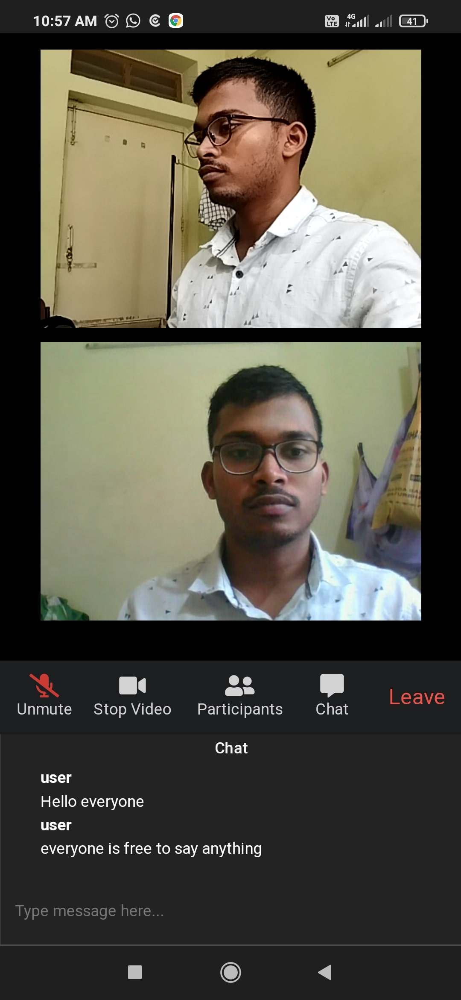

# [[anonymous-colleague-meet](https://colleague-meet-backend.herokuapp.com/)]
A simple video chat application where you can chat with your colleague anonymously
[[App link](https://colleague-meet-backend.herokuapp.com/)]

## Technology used
WebSockets (Socket.io) 
WebRTC (PeerJS) 
Node.js  Express.js  
EJS view engine  

## Features
- [x] Start a meeting or Join a meeting using shared meeting ID
- [x] live meeting link can directly be used to join meeting
- [x] Chat feature, Audio/Video on/off , anonymous chat

## Demo images
### Home page -
 

 
 

 
 

### Live Meet page -
 

 
 

 
 
